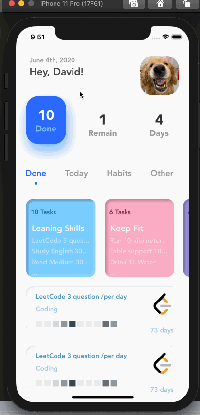

 DGeneration: 坚持打卡，顶住后浪😂
======================================

 

坚持了个把月，用打卡方式坚持每天练英语半小时，每天3道算法题，每天刷Medium的每日推荐文章，每周至少写一篇博客等。
用了一些打卡软件，都不是很满意，所以抽业余时间自己做个好了。

## 设计图

周末先做了个最小闭环的设计，先按这个实现，后续再迭代。

## 首页效果

  

## 这个月的TODO LIST

* Neumorphic风格卡片
* 漂浮按钮点击效果等一些基础组件
* 设计中的基础功能
* Siri Kit接入

## Product Story

* AppExtension添加快捷操作Widget
* 服务端接入

